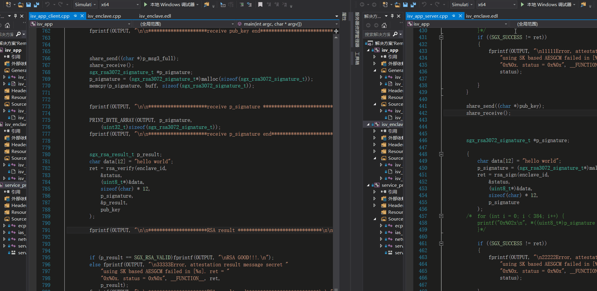

# sgx_remote_attestation

## 一、SGX RSA应用要求

（1）程序采用C/S架构，可以实现简化的本地通信（或者网络通信）
（2）server应用程序中包含EnclaveA，提供服务：生成RSA密钥对并返回公钥，对目标数据进行RSA签名。
（3）client应用程序中包含EnclaveB，实现功能：获取EnclaveA生成的RSA公钥，测试EnclaveA的签名功能。

## 二、实现难度

实现难度为难度B：

EnclaveA与B之间进行模拟的remote attestation，实现双向身份验证

参考代码为 SampleCode/RemoteAttestation

## 三、IAS过程

参考SampleCode过程，IAS过程如下图所示，因此只要分清楚4个msg，是谁发给谁，就可以把SampleCode拆解为两个进程版本。

参考：https://software.intel.com/zh-cn/articles/code-sample-intel-software-guard-extensions-remote-attestation-end-to-end-example

## 四、程序总体设计

程序总体基于样例代码的Remote attestation编写。客户端和服务端分别启动一个独立的enclave，两者之间的通讯通过**共享内存的进程通讯方式**进行通讯。 

远程RSA认证，采用的是sgx_tcrypto.h头文件中定义的sgx_create_rsa_key_pair()，sgx_rsa3072_verify()，sgx_rsa3072_sign()三个函数。可以在enclave中分别写三个函数，直接使用上述三个文件即可。

其中重要的一点，是要保证RSA算法生成密钥时，需要在enclave中生成，其中的中间参数p、q、dmp1、dmq1和p_iqmp在生成后需要及时销毁，防止测信道攻击。

## 五、运行环境 运行方式

使用windows 需要安装SDK 使用sim模式 两端的通讯基于share memory

先启动 server：\server\x64\Simulation\isv_app.exe

后启动 client：\client\x64\Simulation\isv_app.exe

## 六、验收方式

如果无法运行，请看result目录下的gif和server端和client端的log文件

